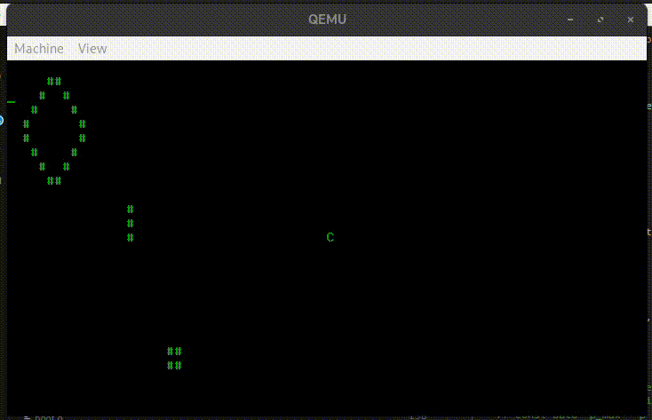

# Conway's Game of Life Operating System
An operating system that's just Conway's Game of Life.



## Building
See the [makefile](Makefile). Try `make clean && make all && make run`.

### Dependencies
Look at the [Dockerfile](Dockerfile) for some recommended packages.
```console
# pacman -S base-devel g++ grub libisoburn mtools qemu-full
```

## Usage
Controls are as follows:
```
[space]        - start/stop simulation
[arrows]       - move cursor
X              - kill cell at cursor
C              - spawn cell at cursor
```

## TODO
- splash screen with controls ([enter] to continue)
- use PIT instead of spamming io_wait (which can damage hardware)
- vesa graphics
- better keyboard driver (IRQ)
- scrollable map (and/or zoom if vesa graphics added)
